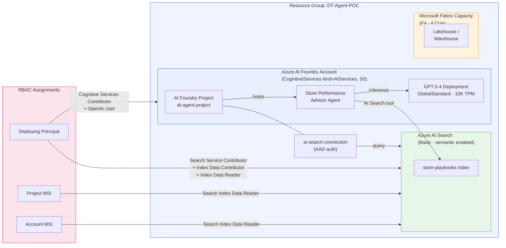
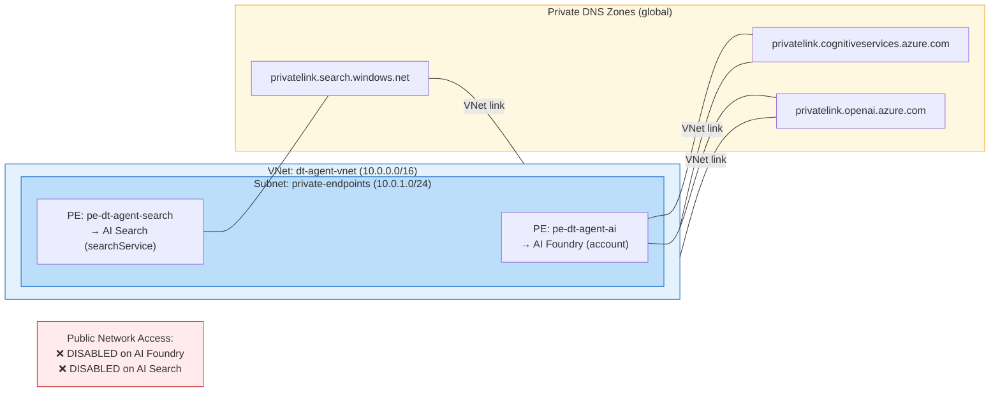

# DT-Agent-POC-Accelerator

Infrastructure-as-Code accelerator for the **Discount Tire Store Performance Advisor** — an AI Foundry agent that helps store managers, AVPs, and RVPs understand performance and take action.

Deploy with **Bicep** (via Azure Developer CLI) or **Terraform** — both produce identical infrastructure.

## What Gets Deployed

| Resource | SKU | Purpose |
|----------|-----|---------|
| **Resource Group** | `DT-Agent-POC` | Container for all resources |
| **Azure AI Foundry** (account + project) | S0, `allowProjectManagement: true` | Hosts the agent, model deployments, and tool connections |
| **GPT-5.4** model deployment | GlobalStandard, 10K TPM | LLM powering the agent |
| **Azure AI Search** | Basic, semantic enabled | Knowledge base for operational playbooks |
| **AI Search connection** | AAD auth | Auto-wired to the Foundry project |
| **Microsoft Fabric** capacity | F4 (configurable) | Semantic layer for store KPIs |
| **VNet + Private Endpoints** *(optional)* | — | Network isolation for AI Services & Search |

### RBAC (auto-provisioned)

| Principal | Resource | Role |
|-----------|----------|------|
| Deploying user | AI Foundry | Cognitive Services Contributor |
| Deploying user | AI Foundry | Cognitive Services OpenAI User |
| Deploying user | AI Search | Search Service Contributor |
| Deploying user | AI Search | Search Index Data Contributor |
| Deploying user | AI Search | Search Index Data Reader |
| Foundry project MSI | AI Search | Search Index Data Reader |
| Foundry account MSI | AI Search | Search Index Data Reader |

## Prerequisites

- Azure subscription with permissions to create resource groups, Cognitive Services, AI Search, and Fabric capacities
- [Azure CLI](https://learn.microsoft.com/cli/azure/install-azure-cli) (`az`) — required for both paths
- **Bicep path:** [Azure Developer CLI](https://learn.microsoft.com/azure/developer/azure-developer-cli/install-azd) (`azd`)
- **Terraform path:** [Terraform >= 1.5](https://developer.hashicorp.com/terraform/install)

## Repo Structure

```
DT-Agent-POC-Accelerator/
├── README.md
├── azure.yaml                    # azd project definition (Bicep path)
├── infra/                        # Bicep templates
│   ├── main.bicep                # Entry point (subscription-scoped)
│   ├── resources.bicep           # All resources + optional private networking
│   └── main.parameters.json      # azd parameter bindings
└── terraform/                    # Terraform configuration
    ├── providers.tf              # azurerm + azapi + random providers
    ├── variables.tf              # All inputs with defaults
    ├── main.tf                   # AI Foundry, Search, Fabric, GPT-5.4
    ├── roles.tf                  # RBAC assignments
    ├── connections.tf            # AI Search connection on Foundry project
    ├── networking.tf             # Optional VNet + PEs + DNS zones
    ├── outputs.tf                # All resource endpoints and names
    └── terraform.tfvars.example  # Example variable values
```

---

## Option A: Deploy with Bicep (azd)

```bash
# 1. Install Azure Developer CLI
winget install Microsoft.Azd

# 2. Clone and initialize
git clone https://github.com/claraworkman/DT-Agent-POC-Accelerator.git
cd DT-Agent-POC-Accelerator
azd init

# 3. Configure
azd env set AZURE_LOCATION eastus2
azd env set FABRIC_ADMIN_UPN your-email@domain.com

# 4. Deploy
azd up
```

### Bicep Configuration

| Variable | Required | Default | Description |
|----------|----------|---------|-------------|
| `AZURE_LOCATION` | Yes | `eastus2` | Azure region for all resources |
| `AZURE_SEARCH_LOCATION` | No | Same as primary | Override if primary region has no Search capacity |
| `FABRIC_ADMIN_UPN` | Yes | — | Email (UPN) of the Fabric capacity admin |
| `ENABLE_PRIVATE_NETWORKING` | No | `false` | Provisions VNet + private endpoints |

### Bicep Teardown

```bash
azd down --purge
```

> The `--purge` flag permanently deletes soft-deleted Cognitive Services accounts.

---

## Option B: Deploy with Terraform

```bash
# 1. Clone and navigate
git clone https://github.com/claraworkman/DT-Agent-POC-Accelerator.git
cd DT-Agent-POC-Accelerator/terraform

# 2. Copy and edit variables
cp terraform.tfvars.example terraform.tfvars
# Edit terraform.tfvars with your subscription_id, principal_id, and fabric_admin_members

# 3. Deploy
terraform init
terraform plan
terraform apply
```

### Terraform Variables

| Variable | Required | Default | Description |
|----------|----------|---------|-------------|
| `subscription_id` | Yes | — | Azure subscription ID |
| `principal_id` | Yes | — | Object ID of the deploying user (for RBAC) |
| `fabric_admin_members` | Yes | — | List of UPNs for Fabric capacity admins |
| `location` | No | `eastus2` | Azure region |
| `search_location` | No | Same as `location` | Override for AI Search region |
| `openai_model_name` | No | `gpt-5.4` | Model to deploy |
| `openai_model_version` | No | `2026-03-05` | Model version |
| `openai_capacity` | No | `10` | TPM in thousands |
| `fabric_sku` | No | `F4` | Fabric capacity SKU |
| `enable_private_networking` | No | `false` | Provisions VNet + private endpoints |

> **Note:** Terraform uses the `azapi` provider for Foundry projects, model deployments, Fabric capacities, and project connections — these resources are not yet available in the native `azurerm` provider.

### Terraform Teardown

```bash
terraform destroy
```

---

## Architecture



### Private Networking Overlay

When `enable_private_networking = true`, the following resources wrap the core infrastructure:



#### What Private Networking Does

| # | What | Why |
|---|------|-----|
| 1 | Creates a **VNet** (`dt-agent-vnet`, 10.0.0.0/16) with a dedicated subnet (10.0.1.0/24) | Provides an isolated network boundary for Azure PaaS services |
| 2 | Deploys **private endpoints** for AI Foundry and AI Search | Assigns private IPs inside the VNet — all traffic stays on the Microsoft backbone, never traverses the public internet |
| 3 | **Disables public network access** on both AI Foundry and AI Search | Makes the services completely unreachable from the internet |
| 4 | Creates **3 private DNS zones** linked to the VNet | Ensures DNS resolution routes to the private IPs (`privatelink.cognitiveservices.azure.com`, `privatelink.openai.azure.com`, `privatelink.search.windows.net`) |

**Practical effect:** Only resources inside (or peered to) the VNet can reach the AI services. This is ideal for production and compliance scenarios where endpoints must not be publicly exposed.

> 💡 **For PoC/demo use**, leave private networking **disabled** so you can access the services from your laptop and the Foundry portal without requiring a VPN or ExpressRoute connection.

#### Enable Private Networking

```bash
# Bicep
azd env set ENABLE_PRIVATE_NETWORKING true && azd up

# Terraform
# Set enable_private_networking = true in terraform.tfvars
terraform apply
```

## Post-Deployment

After infrastructure is provisioned:

1. **AI Search tool** — auto-wired via the `ai-search-connection` (no action needed)
2. **Upload playbooks** — index operational playbooks into AI Search for RAG grounding

## Cost Estimate (Monthly)

| Resource | Estimated Cost |
|----------|---------------|
| AI Foundry (S0) | ~$0 (pay-per-token only) |
| GPT-5.4 (10K TPM) | ~$0.01/1K input tokens |
| AI Search (Basic) | ~$70/mo |
| Fabric F4 | ~$526/mo (can pause) |
| **Total (active)** | **~$600/mo** |

> 💡 Fabric capacity deploys **paused** by default — no billing until resumed in the Fabric admin portal. With Fabric paused, cost is ~$70/mo (Search only).

## License

MIT
